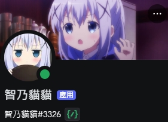

# KafuChino

[](https://www.python.org/)
[](https://www.python.org/downloads/release/python-3100/)
[](https://https://discord.com/)
[](https://github.com/peter910820/KafuChino/blob/main/LICENSE) 

---

 

---
| [English](/) | [繁體中文](./doc/README_zh.md) |  

This project is a music bot for discord, evolved from previous versions:  

[SuouYuki](https://github.com/peter910820/SuouYuki) 

[NikaidoShinku](https://github.com/peter910820/NikaidoShinku) 

[KirimaSharo](https://github.com/peter910820/KirimaSharo) 

## Installation & Use 
```bash
git clone https://github.com/peter910820/KafuChino.git
cd ./KafuChino/
pip install -r requirements.txt
```  

> [TODO]  
> - [ ] change YT-PLAYER embed output thumbnail to music thumbnail when music play
> - [ ] change presence when music change  

[](https://creativecommons.org/licenses/by-nc-sa/4.0)